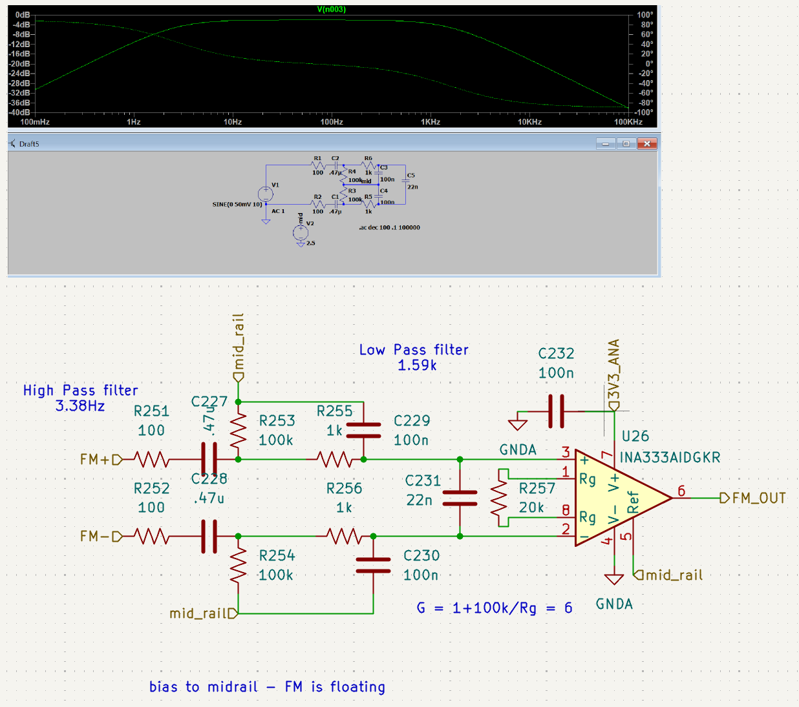
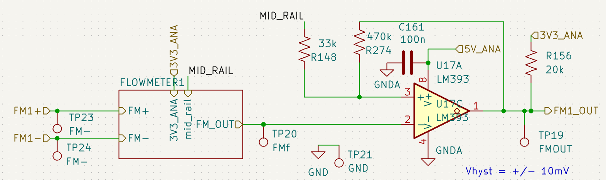
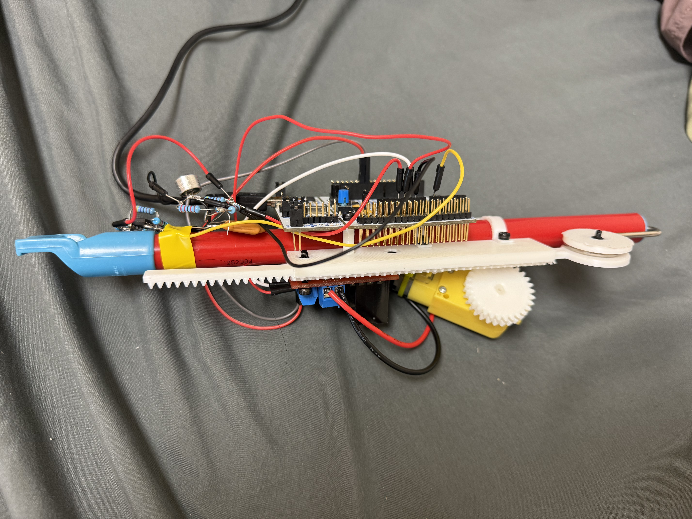

# Hardware Portfolio - Alexis Manens

## Icarus - Rocket Test-Stand DAQ and Controls

I designed this four-layer STM32H7 PCB for Icarus's LNG/LOX rocket test stand. This is the fifth iteration. The board needs to acquire sensor data, control valves and pumps, and provide feedback for active flow-rate control. It integrates power stages, analog signal conditioning, and peripheral interfaces, with firmware coordinating measurement and control. We are a small team and I'm the only electrical engineer, so I designed, did the layout, brought up, tested, and developed firmware for the board on my own.

### Flowmeter signal conditioning

The flowmeter's output spans roughly **30 mV peak-to-peak to 1 V peak-to-peak**. I designed the conditioning circuit to filter the signal with a band pass in the range I expected cutting out high frequency noise while removing slow DC drifts. I referenced it to a mid-rail in order to keep my signal positive and finally amplify it before passing it through an edge to edge op amp comparator. The result is a square wave with digital edges the MCU can detect.

I measure flow rate asynchronously using triggers on both rising and falling edges, allowing the firmware to respond to flowmeter events while other tasks continue. These measurements provide the feedback needed to adjust the pump toward a target flow rate. Reliable edge detection is therefore an essential part of the control loop which is why this conditioning was required.

I realized that with the number of channels of sensor data that could be coming in at any time, asynchronous hardware triggers were the best way to solve this problem. 

[View the full schematic](full_schematic.pdf)

### BONUS: making a part mismatch work

During bringup, I discovered that I had put the wrong IC version on the BOM. With a testing deadline approaching, I manually connected each pin to the appropriate board connection using fine copper wire from motor windings. The temporary bodge let us keep testing.

I'm still learning, and this was a mistake I had to own. It also gave me a chance to find a practical fix and keep the project moving under a deadline.

## BONUS 2: Slide Flute - Pitch-Controlled Motor

For this free-wired project, I filtered and conditioned a microphone signal with an op amp before sampling it as an analog input. I implemented an FFT to estimate the pitch, then used a PID loop to adjust the slide motor based on the measured pitch and target note. I had to work with a tradeoff between FFT resolution and maintaining a fast data rate for the PID loop on the limitations of the STM32F4.

The video shows the flute playing **“Do-Re-Mi” from *The Sound of Music*.**

[Watch the slide flute demo] https://drive.google.com/file/d/1y4VvZTSjhm1QNSebmx95rc-MDeux3d-p/view?usp=sharing
